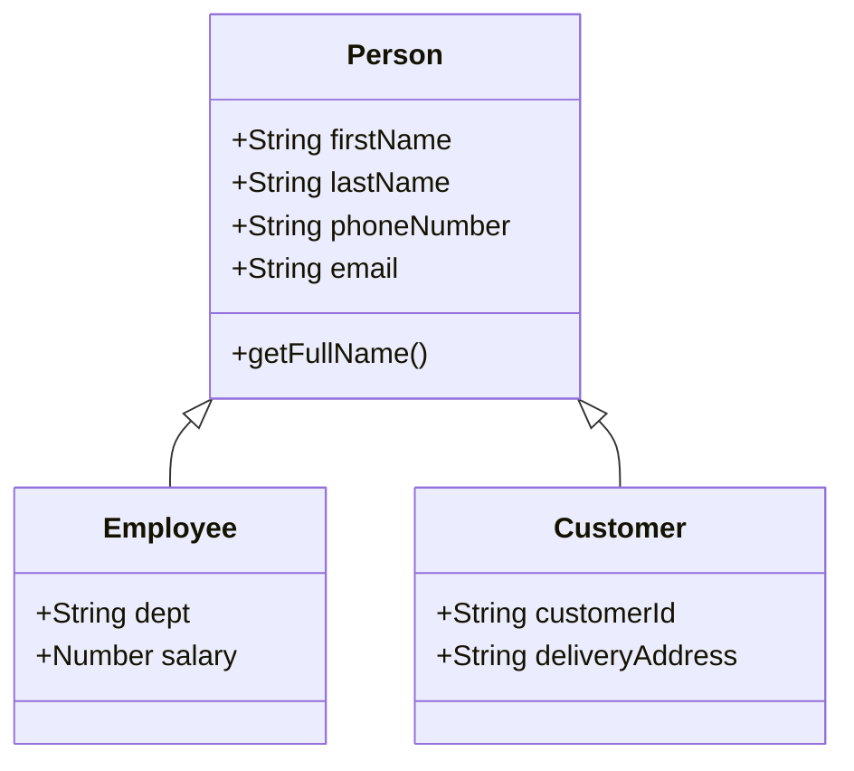

# Classes Inheritance Example

This example demonstrates **JavaScript class inheritance** with the following structure:

- A base `Person` class that contains shared properties and methods.
- Two child classes, `Employee` and `Customer`, that inherit from `Person` and add their own specific properties.

## Class Diagram



## Example Output

```
-------------------------------------------------------
John Doe works in Accounts department
-------------------------------------------------------
Customer: Peter Kelly, Delivery Address: 11 Hill Road, Christchurch
-------------------------------------------------------
Employee { firstName: 'John', lastName: 'Doe', phoneNumber: '0123456789', email: 'john@example.com', dept: 'Accounts', salary: 90000 }
-------------------------------------------------------
Customer { firstName: 'Peter', lastName: 'Kelly', phoneNumber: '0236456789', email: 'peter@example.com', cusomerId: 'C101', deliveryAddress: '11 Hill Road, Christchurch' }
-------------------------------------------------------
```

## Running the Code

Run the file using Node.js:

```bash
node person.js
```