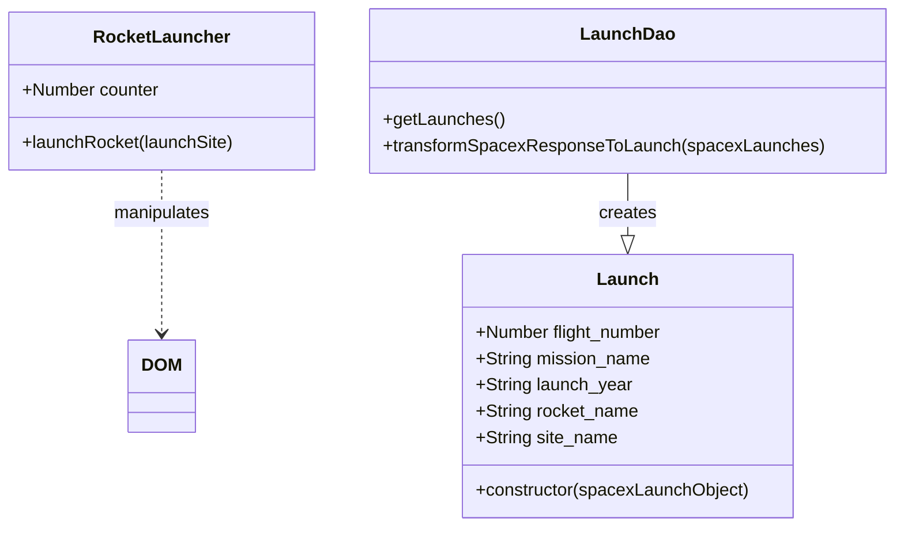

# Class Diagram for Rocket Launch App

This document contains the Mermaid class diagram for the JavaScript classes used in the Rocket Launch application.

### Class Descriptions:

- **RocketLauncher:**

  - Responsible for launching rockets visually on the page.
  - Tracks the number of launches.

- **Launch:**

  - Represents a single Launch event.
  - Stores relevant properties extracted from the SpaceX API response.

- **LaunchDao:**

  - Responsible for fetching and transforming SpaceX launch data.
  - Converts raw API data into `Launch` instances.

### Diagram Notes:

- The arrow `--|>` indicates that `LaunchDao` creates instances of `Launch`.
- The dotted arrow `..>` indicates that `RocketLauncher` interacts with the DOM.

